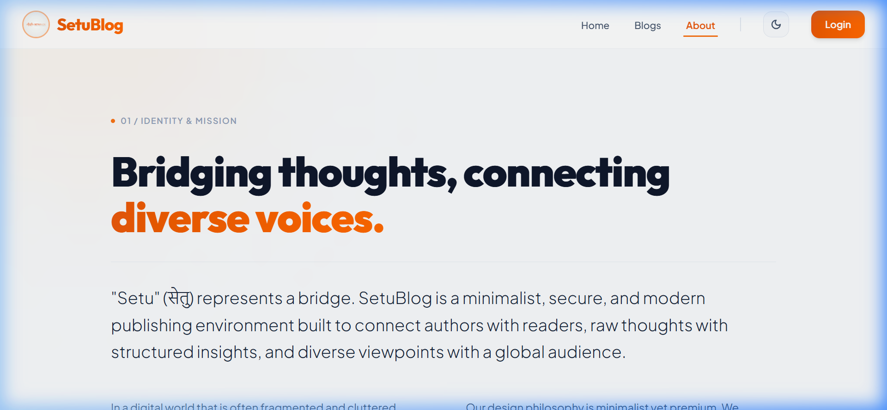
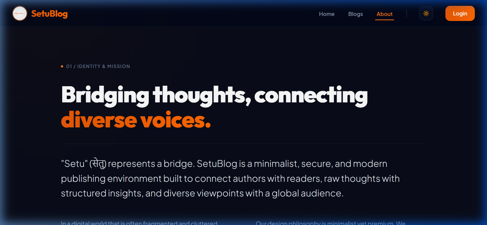

# SetuBlog

## Motivation
Based on the requests that I got to demonstrate a production-grade full-stack blogging system built on the MERN stack.

I decided to create SetuBlog—a MERN (MongoDB, Express, React 19, Node.js) based publishing web application. The goal is to help full-stack developers learn clean architecture, state management (using React Context), and how to decouple modules effectively while maintaining premium visual layouts and strict security protocols.

---

## Introduction
It's a good practice to keep a simple and organized architecture. There are various techniques, design patterns, and folder structures that are used by developers for their projects, and it's perfectly fine to have your own unique architecture.

The end goal of the usage of any design or architectural pattern is usually the same:
* **Adding a new requirement should be easy.** (Modular API routers and component-focused frontend design make extension seamless).
* **Completing any new task/requirement should not break any existing features.** (Auth guards, rate limiters, and decoupled controllers keep systems independent).
* **It should enable individual development & deployment of features.** (Separating backend controllers from frontend layout components ensures parallel development).
* **Components/Modules should be testable without dependencies.** (Database utilities and route services can be isolated for mock validations).

---

## Screenshots
### Web Client Interface (Light / Dark Modes)

| Light Mode | Dark Mode |
| :---: | :---: |
|  |  |

---

## Languages / Frameworks Used
* **React 19 & Vite** (Frontend Client)
* **Tailwind CSS v4** (Aesthetic Design Tokens & Transitions)
* **Node.js & Express 5** (API Backend Server)
* **MongoDB & Mongoose** (Database Schema & Aggregations)
* **JWT (JSON Web Tokens)** (HttpOnly Secure Session Cookies)
* **Express Rate Limit** (DDoS & Brute Force Prevention)

---

## How to run the project ?
1. **Clone the project:**
   ```bash
   git clone https://github.com/premd1991/BlogSetu.git
   cd BlogSetu
   ```
2. **Configure Environment variables:**
   Create a `.env` file inside the `backend/` folder:
   ```env
   PORT=8000
   MONGO_URI=your_mongodb_atlas_connection_string
   JWT_PRIVATE_KEY=your_secure_jwt_secret_key
   NODE_ENV=development
   ```
3. **Start the Backend API Server:**
   ```bash
   cd backend
   npm install
   npm start
   ```
4. **Start the Frontend Client:**
   ```bash
   cd ../frontend
   npm install
   npm run dev
   ```

---

## Having trouble ?
If you are having trouble with this project or if you find any bugs, do open a new issue and describe the problem.
Alternatively, you can drop me a mail @ praveen.dangwal1991@gmail.com.

---

## Spread the word!
Liked the project? Just give it a star ⭐️ and spread the word!

## Credits
© Praveen Dangwal | 2026
